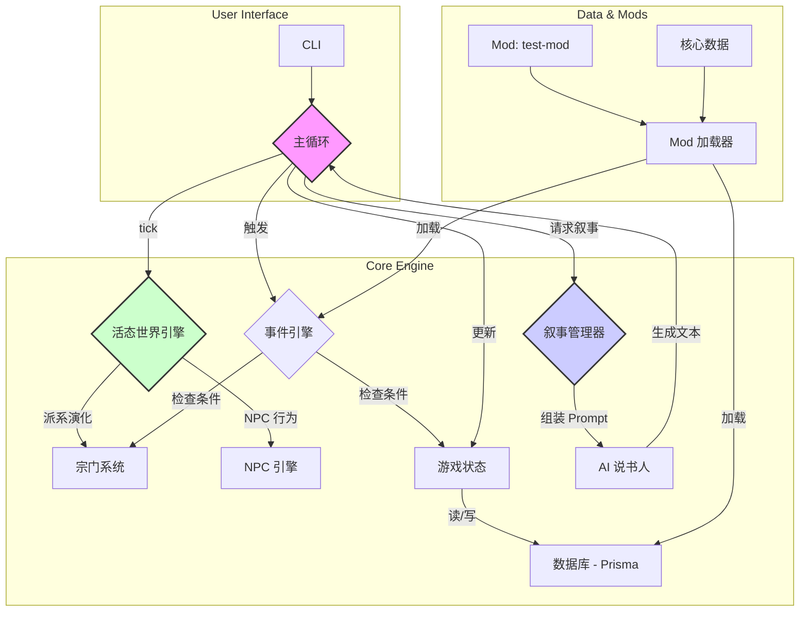

# 江湖残卷 - AI 驱动的武侠 Roguelike 叙事引擎

[](https://github.com/xiaoxiath/jianghupu)
[](https://opensource.org/licenses/ISC)
[](https://www.prisma.io/)
[](https://www.typescriptlang.org/)

## 简介

**《江湖残卷》** 是一款基于文本的、由大型语言模型 (LLM) 驱动的动态叙事游戏。在这里，没有固定的剧本，每一次冒险都是由 AI “说书人”与一个自行演化的虚拟世界共同谱写的、独一无二的传奇。

### 核心特性

- **AI 说书人**: 游戏的核心驱动力。它会根据你的行为、角色的状态以及世界中发生的重大事件，实时生成场景描述和故事选项，确保每次游戏体验都充满变数。
- **活态世界**: 你不是世界的中心。在你探索的同时，NPC 们在修炼，宗派之间在合纵连横。世界在后台自行演化，你可能会发现自己不经意间就卷入了一场波及整个江湖的纷争。
- **无限轮回**: 死亡并非终点。在这个 Roguelike 世界中，当你的角色陨落后，其生平事迹将化为传说，被后人铭记。你可以开启新的轮回，并继承前代角色留下的“遗产”，踏上新的江湖路。
- **高度可扩展**: 游戏内置了强大的 Mod 系统，允许社区通过简单的数据文件和脚本，创造自己的武学、物品、事件、宗派，甚至是全新的故事线。

## 文档

- **[玩家指南 (USER_GUIDE.md)](docs/USER_GUIDE.md)**: 了解游戏的核心概念、基本操作和背景故事。
- **[Mod 开发指南 (MODDING_GUIDE.md)](docs/MODDING_GUIDE.md)**: 学习如何为游戏创建自己的内容扩展。
- **[项目路线图 (roadmap.md)](docs/roadmap.md)**: 查看项目的详细规划和未来目标。

## 项目架构

下图展示了《江湖残卷》的核心模块及其交互关系：



## 技术栈

- **语言**: **TypeScript**
- **运行环境**: **Node.js**
- **构建/执行**: **tsx** (用于开发), **esbuild** (用于生产构建)
- **数据库 ORM**: **Prisma**
- **数据库**: **SQLite** (易于分发和使用)
- **命令行交互**: `inquirer`, `chalk`
- **核心理念**: 数据驱动、模块化、事件驱动、高度可扩展

## 快速开始 (本地开发)

1. **环境要求**:
    - Node.js (建议 v18 或更高版本)
    - pnpm (或 npm/yarn)

2. **克隆仓库**:

    ```bash
    git clone https://github.com/xiaoxiath/jianghupu.git
    cd jianghupu
    ```

3. **安装依赖**:

    ```bash
    pnpm install
    ```

4. **设置数据库**:
    此命令会根据 `prisma/schema.prisma` 创建 `dev.db` 数据库文件并应用所有迁移。

    ```bash
    pnpm prisma migrate dev
    ```

5. **运行开发模式**:
    游戏将在你的终端中启动。`tsx` 会实时编译并运行 TypeScript 代码。

    ```bash
    pnpm dev
    ```

## 目录结构说明

```
.
├── docs/          # 项目文档 (路线图、设计文档)
├── mods/          # 社区 Mod 目录
│   └── test-mod/  # 一个示例 Mod
├── prisma/        # 数据库模型和迁移
├── src/
│   ├── core/      # 核心引擎 (状态, 主循环, 事件, Mod 加载器)
│   ├── data/      # 基础游戏数据 (事件, 物品等)
│   ├── narrator/  # AI 说书人模块 (场景管理, Prompt 模板)
│   ├── systems/   # 游戏核心机制 (战斗, 修炼, 宗门)
│   └── ui/        # 用户界面 (CLI, 渲染器)
├── package.json
└── README.md
```

## 如何贡献

我们欢迎任何形式的贡献！

- **流程**: 请遵循标准的 Fork -> Feature Branch -> Pull Request 流程。
- **代码风格**: 请遵循项目现有的代码风格和约定。
- **提交 Issue**: 如果你发现了 Bug 或有新功能的建议，请通过 Issue 提出。
- **欢迎贡献的领域**:
  - 为 `src/data/` 目录添加新的事件、物品、武学。
  - 优化 `src/narrator/templates/` 中的 AI Prompt。
  - 扩展核心系统，例如实现更复杂的战斗或修炼机制。
  - 创建新的 Mod！

