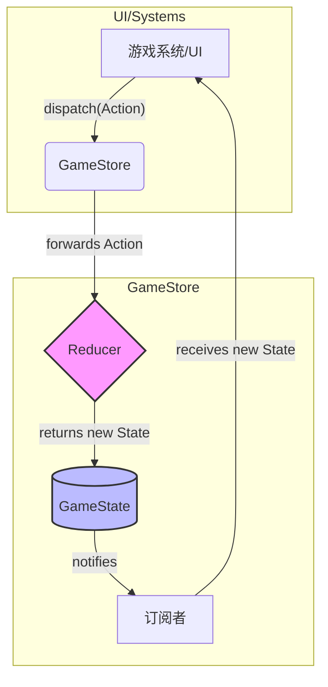
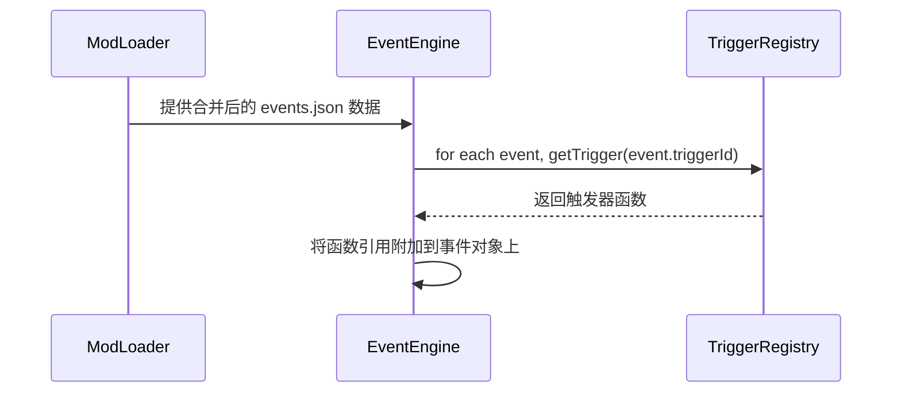
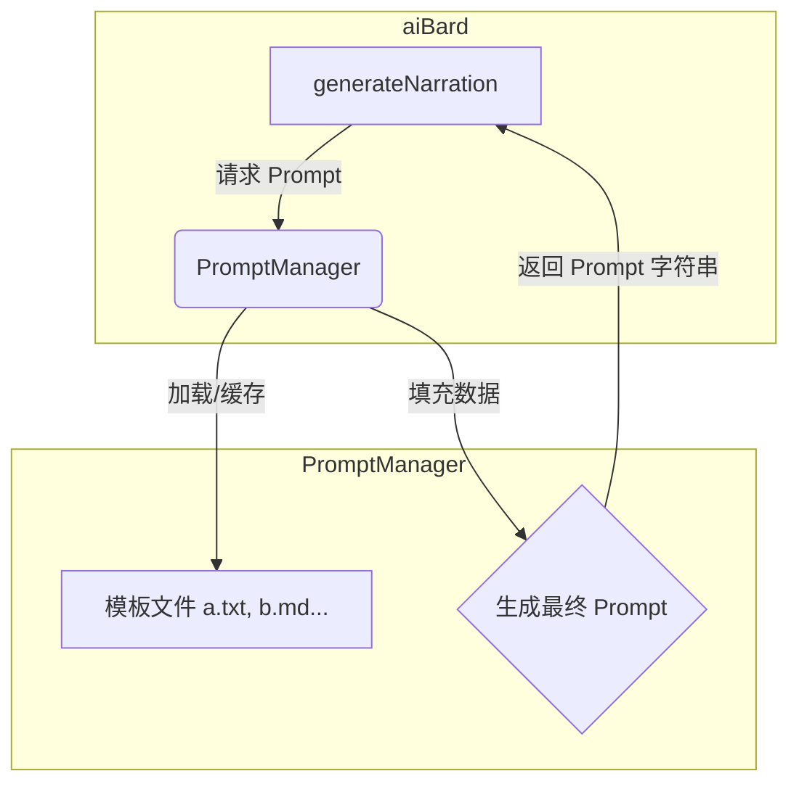

# 《江湖残卷》项目重构规划

## 1. 引言

本文档旨在为《江湖残卷》项目提供一个清晰、可行的重构路线图。当前项目已成功验证了核心玩法和AI叙事概念，但随着功能的增加，现有架构在可维护性、可扩展性和健壮性方面暴露了若干问题。

本次重构旨在解决这些问题，为项目未来的长期发展奠定坚实的技术基础。

## 2. 核心重构领域

我们将重点关注以下四个领域：

1.  **状态管理 (State Management)**
2.  **事件系统 (Event System)**
3.  **AI叙事模块 (AI Narrator)**
4.  **依赖注入 (Dependency Injection)**

---

### 2.1. 状态管理重构：引入 Redux 模式

**当前问题**:
- 全局可变的 `gameState` 对象导致数据流混乱，难以追踪状态变更。
- 任何模块都可以直接修改状态，容易引发不可预期的副作用和竞态条件。
- 状态变更逻辑分散在各个模块中，缺乏统一管理。

**重构目标**:
- 建立一个单向、可预测的数据流。
- 集中管理所有状态变更逻辑。
- 使状态的变更可追溯、可调试。

**实施方案**:

1.  **引入状态容器 (Store)**: 创建一个单一的 `GameStore` 类，负责持有整个游戏状态 (`GameState`)。状态本身将变为只读。

2.  **定义 Action**: 创建一系列具名 `Action`，用于描述所有可能的状态变更。例如 `TravelAction`, `ApplyEventResultAction`。

3.  **创建 Reducer**: 编写一个纯函数 `gameReducer(state: GameState, action: Action): GameState`。此函数接收当前状态和 `Action`，并返回一个全新的状态对象，而不是修改原状态。

**新架构图**:



---

### 2.2. 事件系统重构：声明式事件

**当前问题**:
- 使用 `new Function()` 动态执行字符串形式的触发器，存在安全隐患，且无法利用 TypeScript 的类型检查。
- 触发器逻辑与事件定义耦合在 JSON 文件中，难以调试和复用。

**重构目标**:
- 将事件触发器变为类型安全的、可导入的函数。
- 事件定义文件 (`events.json`) 只负责数据声明。

**实施方案**:

1.  **创建触发器注册表**: 创建一个 `EventTriggerRegistry`，用于映射触发器ID到具体的函数实现。
2.  **重构事件定义**: 修改 `events.json`，将 `trigger` 字段从代码字符串改为一个触发器ID字符串，例如 `"trigger": "isPlayerInLocation"`.
3.  **修改事件加载逻辑**: `EventEngine` 在加载时，会使用注册表将触发器ID替换为对应的函数引用。

**新事件加载流程**:



---

### 2.3. AI 叙事模块重构：Prompt 模板化

**当前问题**:
- Prompt 构建逻辑硬编码在 `aiBard.ts` 中，难以维护和扩展。
- 混合了逻辑、结构和文本内容，修改任一部分都很困难。

**重构目标**:
- 将 Prompt 的内容、结构和填充逻辑完全分离。
- 允许非开发人员（如策划）方便地修改和创建新的 Prompt。

**实施方案**:

1.  **创建模板文件**: 将 Prompt 拆分为多个 `.txt` 或 `.md` 模板文件，存放于 `src/narrator/templates/` 目录下。
    - `system_role.md`: 定义 AI 的角色。
    - `context_world.md`: 定义世界上下文的格式。
    - `context_player.md`: 定义玩家状态的格式。
    - `task_instruction.md`: 定义核心任务指令。
    - `output_format.json`: 定义输出的 JSON 结构示例。
2.  **创建 `PromptManager`**: 负责加载、缓存和填充这些模板。它将提供一个接口 `buildPrompt(data)`，接收上下文数据并生成最终的 Prompt 字符串。
3.  **重构 `aiBard.ts`**: `generateNarration` 函数将不再自己构建 Prompt，而是调用 `PromptManager` 来完成。

**新 Prompt 构建流程**:



---

### 2.4. 依赖注入重构：全面构造函数注入

**当前问题**:
- `tsyringe` 的使用不一致，存在手动调用 `container.resolve()` 的情况。
- 模块间的依赖关系不够清晰。

**重构目标**:
- 统一使用构造函数注入来管理依赖。
- 让依赖关系在代码中更加明确和易于管理。

**实施方案**:

1.  **审查所有类**: 检查所有 `@singleton()` 或可注入的类。
2.  **修改构造函数**: 将所有 `container.resolve()` 调用替换为构造函数参数，并使用 `@inject` 或 `@injectAll` 装饰器。
3.  **确保注册**: 确保所有被注入的依赖都已在容器中正确注册。

**示例**:

**之前**:
```typescript
@singleton()
export class SceneManager {
  private timeSystem: TimeSystem;
  constructor() {
    this.timeSystem = container.resolve(TimeSystem);
  }
}
```

**之后**:
```typescript
@singleton()
export class SceneManager {
  constructor(private timeSystem: TimeSystem) {}
}
```

## 3. 重构步骤与时间线

重构将按照以下顺序分步进行，以确保平稳过渡：

1.  **第一阶段：依赖注入整理** (预计 0.5 天)
    - 全面推行构造函数注入。这是后续重构的基础。
2.  **第二阶段：状态管理重构** (预计 1.5 天)
    - 实现 `GameStore`, `Action` 和 `Reducer`。
    - 改造核心模块以适应新的状态管理模式。
3.  **第三阶段：事件系统与AI叙事重构** (预计 1 天)
    - 并行实施事件系统和AI叙事模块的重构，因为它们相互独立。
4.  **第四阶段：集成与测试** (预计 1 天)
    - 确保所有模块在新架构下正常工作。
    - 编写或更新测试用例。

总计：约 4 天。

## 4. 风险与应对

- **风险**: 重构范围较广，可能引入新 Bug。
- **应对**:
    - 每个阶段都进行充分测试。
    - 保持小的、原子的提交，方便回滚。
    - 在独立的 `refactor` 分支上进行，不影响主线开发。
