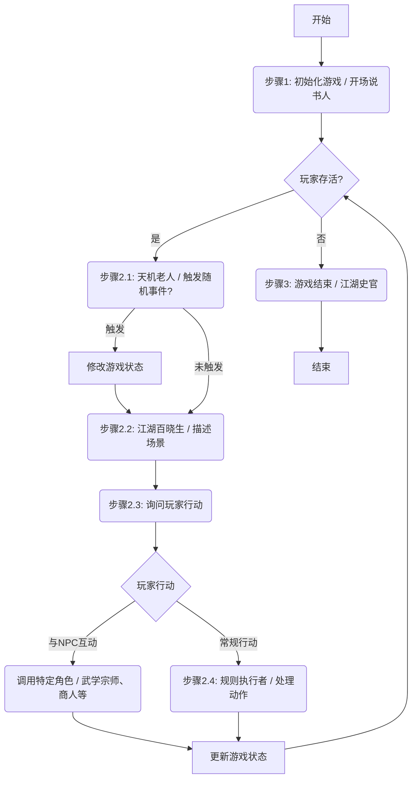

# 武侠 Roguelike 游戏：新增 AI 角色设计文档

本文档旨在为《武侠 Roguelike》游戏设计一系列新的 AI 角色，以增强游戏的动态性、互动性和故事深度。这些角色将与现有的核心游戏循环无缝集成，共同构建一个更加生动、充满变数的江湖世界。

## 1. 现有 AI 角色回顾

- **开场说书人**: 游戏起点，负责世界初始化。
- **江湖百晓生**: 场景描述者，玩家的眼睛和向导。
- **规则执行者**: 核心裁判，处理玩家行动和世界规则。
- **江湖史官**: 游戏终点，负责结局呈现。

现有角色构成了稳定的游戏框架，但缺乏动态事件和NPC互动。

## 2. 新增 AI 角色设计

为了让江湖“活”起来，我们引入以下四个核心角色：

### 2.1. 天机老人 (Story Engine & Event Trigger)

- **核心职责**: 担任动态故事引擎，根据游戏状态（如时间、地点、玩家行为、世界事件）触发特殊剧情或随机事件。
- **触发机制**: 在每个游戏循环的开始（`present_the_scene` 之前）被调用，以低概率触发事件。
- **输出**: 可以是一个事件对象，该对象将修改当前的游戏状态，例如在场景中加入一个新 NPC、一件物品，或者改变环境描述。
- **示例**:
    - *时间流逝*: “你在黑风山脚下已逗留数日，听闻山顶的破败寺庙近日隐有宝光传出...”
    - *玩家行为*: “你多次在战斗中依赖「猛虎拳」，名声渐起，但也引起了「铁掌帮」的注意...”
    - *随机事件*: “一场突如其来的大雨让你不得不找个山洞躲避，洞穴深处似乎传来微弱的呼救声。”
- **集成方式**: 在 `game_main_loop` 的最开始插入一个新的步骤，专门用于调用“天机老人”。

### 2.2. 江湖过客 (Dynamic NPC)

- **核心职责**: 扮演在世界中随机遇到的各类 NPC，提供互动、任务、交易或冲突。
- **类型**:
    - **商人**: 可进行物品买卖。
    - **信使**: 传递信息或任务。
    - **求助者**: 提供支线任务（如寻人、寻物）。
    - **挑衅者**: 可能引发战斗或冲突。
    - **传闻散播者**: 提供关于世界、宝藏或危险的线索。
- **互动方式**: 当“天机老人”或场景生成逻辑在 `game_state` 中注入一个 NPC 时，“江湖百晓生”会在场景描述中将其描绘出来，并提供与该 NPC 相关的行动选项。
- **示例**: `turn_description` 中出现 “一位行色匆匆的商人拦住了你”，同时 `suggestions` 中增加选项：“与商人交易”。

### 2.3. 武学宗师 (Skill & Progression Master)

- **核心职责**: 为玩家提供学习新武学、提升现有招式或突破内功心法的机会。
- **出现条件**:
    - 到达特定地点（如“大理城”的武馆）。
    - 完成特定任务（由“江湖过客”发布）。
    - 满足隐藏条件（如使用某招式达到一定次数）。
- **互动机制**: 这是一个特殊的 NPC 类型，当玩家选择与其相关的行动（如“拜师学艺”）时，会调用一个专门的 promptlet 来处理技能学习逻辑，更新玩家的 `moves` 或 `base_stats`。
- **示例**: 在大理城，玩家可以选择“进入天龙寺”，如果满足条件，则会遇到一位扫地僧（武学宗师），并获得学习「一阳指」的机会。

### 2.4. 神兵鉴定师 (Lore & Item Master)

- **核心职责**: 丰富物品的背景故事，增加探索和收集的乐趣。
- **触发时机**: 当玩家在行动中选择“查看”、“鉴定”或与特定 NPC（如当铺老板）互动时触发。
- **功能**:
    - 鉴定未知的装备，揭示其真实属性和名称。
    - 讲述特殊物品（如“生锈的铁剑”）背后的传奇故事，可能触发新的任务线索。
- **示例**: 玩家选择“鉴定生锈的铁剑”，此角色返回描述：“这柄剑看似破旧，但剑身上刻着两个模糊的古字——‘湛卢’。传闻此剑曾为铸剑宗师欧冶子所铸，后在江湖中遗失。若能找到重铸之法，或许能再现其锋芒。” 这段描述不仅增加了物品的价值感，还为玩家提供了新的目标。

## 3. Mermaid 图：整合后的游戏循环

这份设计文档为下一步的开发提供了清晰的蓝图。