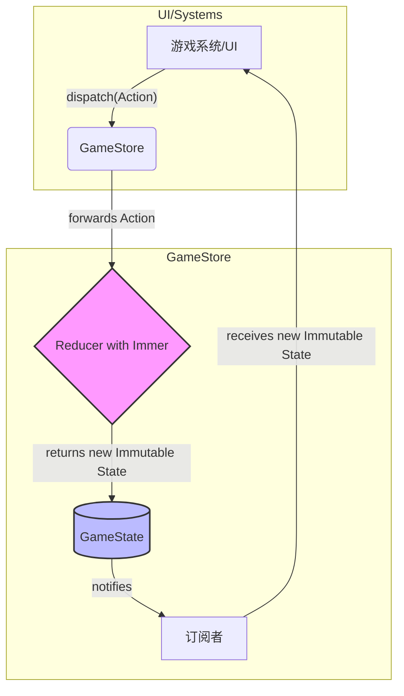

# 《江湖残卷》项目重构规划 (V2 - 基于代码审查更新)

## 1. 引言

本文档基于对当前代码库的详细审查，对原始重构计划进行了关键更新。审查发现，原始计划中的部分目标（特别是事件系统和AI叙事模块的模板化）已在当前代码中得到实现。然而，另一些基础性问题，如状态管理的不一致性和依赖注入的混乱使用，则比预想中更为普遍和严重。

本 V2 计划旨在提供一个更精准、更具可操作性的重构路线图，以解决当前架构中发现的实际问题，为项目的长期发展奠定坚实的技术基础。

## 2. 核心重构领域 (已更新)

我们将重点关注以下三个经过重新评估的领域：

1.  **依赖注入 (Dependency Injection) 的全面统一**
2.  **状态管理 (State Management) 的严格化**
3.  **架构一致性与代码清理**

---

### 2.1. 依赖注入重构：全面转向构造函数注入

**当前问题 (已验证)**:
- 项目中普遍存在通过 `container.resolve()` 手动解析依赖的情况，这使得模块与 DI 容器本身紧密耦合。
- 依赖关系不明确，不阅读函数/方法内部实现，无法了解其依赖项。
- 构造函数注入 (`@inject`) 和手动解析 (`container.resolve()`) 混合使用，缺乏统一规范。
- 严重影响了代码的可测试性，单元测试难以进行。

**重构目标**:
- 彻底移除代码中所有的 `container.resolve()` 调用（引导程序入口除外）。
- 统一使用构造函数注入来管理所有模块间的依赖。
- 使依赖关系在代码中明确、直观。

**实施方案**:

1.  **全局审查**: 识别所有使用了 `container.resolve()` 的 `*.ts` 文件。
2.  **改造类**:
    - 对于类方法中的 `container.resolve()`，将依赖提升为类的私有属性，并通过构造函数注入。
    - 对于独立的函数，将其改造为类的方法，或将依赖作为参数传递。
3.  **修改构造函数**: 为所有需要依赖的类添加构造函数，并使用 `@inject` 或 `@injectAll` 装饰器声明依赖。
4.  **确保注册**: 确保所有被注入的依赖都已在容器中正确注册为 `singleton` 或其他适当的生命周期。

**示例 (与原计划一致)**:

**之前**:
```typescript
@singleton()
export class SceneManager {
  private timeSystem: TimeSystem;
  constructor() {
    this.timeSystem = container.resolve(TimeSystem);
  }
}
```

**之后**:
```typescript
import { inject, singleton } from 'tsyringe';

@singleton()
export class SceneManager {
  constructor(@inject(TimeSystem) private timeSystem: TimeSystem) {}
}
```

---

### 2.2. 状态管理重构：强制状态不可变性

**当前问题 (已验证)**:
- 虽然存在一个类似 Redux 的 `GameStore`，但 `store.getState()` 方法返回的是对状态对象的直接引用。
- 任何模块都可以绕过 `dispatch/reducer` 流程，直接修改 `GameState` 对象的属性，导致数据流不可预测，极易产生副作用。
- 状态变更的来源难以追踪，调试困难。

**重构目标**:
- 建立一个严格的、单向的、可预测的数据流。
- 杜绝一切对 `GameState` 的直接修改。
- 确保所有状态变更都必须通过 `dispatch(Action)` 发生。

**实施方案**:

1.  **强制不可变返回**: 修改 `GameStore.getState()`，使其返回状态对象的深拷贝或使用不可变数据结构库（如 `Immutable.js` 或 `immer`）。考虑到性能和集成成本，`immer` 是一个优秀的首选。
    - `immer` 可以让我们像直接修改一样编写 Reducer，但它会在底层处理不可变更新。
2.  **集成 `immer`**:
    - 将 `immer` 添加到项目中。
    - 使用 `produce` 函数包装 `gameReducer` 的逻辑。
3.  **审计与重构**:
    - 全局搜索对 `store.getState()` 返回值进行属性修改的代码（例如 `store.getState().player.hp = ...`）。
    - 将所有这些直接修改操作，全部重构为定义新的 `Action` 并 `dispatch` 它们。例如，创建一个 `UpdatePlayerHPAction`。
4.  **完善 Reducer**: 在 `gameReducer` 中为所有新创建的 `Action` 实现对应的处理逻辑。

**新架构图 (与原计划一致，但核心是强制执行)**:



---

### 2.3. 架构一致性与代码清理

**背景**:
审查发现，事件系统和 AI 叙事模块的重构已部分完成，但仍存在一些遗留问题、不一致性和待优化的点。

**重构目标**:
- 清理遗留代码和过时的模式。
- 修复现有实现中的 bug 和不一致性。
- 提升模块化和可扩展性。

**实施方案**:

1.  **事件系统 (Event System)**:
    - **处理硬编码触发器**: 修复 `events.json` 中 `"trigger": "true"` 的问题。提供一个内置的 `always()` 触发器函数并在 `triggerRegistry` 中注册，用于处理这类情况。
    - **Mod 可扩展性**: 设计并实现一个机制，允许外部 Mod 动态注册自己的触发器函数到 `triggerRegistry` 中，而不是将所有触发器硬编码在核心代码里。
    - **移除遗留代码**: 清理 `EventEngine` 中所有为后向兼容而存在的 `legacy...` 函数。

2.  **AI 叙事模块 (AI Narrator)**:
    - **移除遗留代码**: 清理 `aiBard.ts` 文件末尾的 `legacy export` 函数 `generateNarration`。
    - **Prompt 数据准备逻辑**: 审查 `AIBard.generateNarration` 中庞大的 `templateData` 构建过程。评估是否可以将其中的部分逻辑进一步抽象和拆分，使 `AIBard` 的职责更单一。

3.  **全局**:
    - **移除所有遗留导出**: 在项目中搜索所有标记为 `legacy` 或 `for backward compatibility` 的导出，并在确认安全后移除它们。

## 3. 重构步骤与时间线 (已更新)

重构将按照以下顺序分步进行，以确保平稳过渡：

1.  **第一阶段：依赖注入整理 (核心)** (预计 2 天)
    - 这是所有重构的基础，必须最先完成。
    - 全面推行构造函数注入，移除 `container.resolve()`。
2.  **第二阶段：状态管理严格化** (预计 1.5 天)
    - 引入 `immer` 并改造 `gameReducer`。
    - 修改 `GameStore.getState()` 返回深拷贝。
    - 审计并重构所有直接修改状态的代码，替换为 `dispatch(Action)`。
3.  **第三阶段：架构一致性清理** (预计 1 天)
    - 并行实施事件系统和AI叙事模块的清理工作。
    - 移除所有已知的遗留函数。
4.  **第四阶段：集成与测试** (预计 0.5 天)
    - 确保所有模块在新架构下正常工作。
    - 运行游戏并测试核心功能路径。

**总计：约 5 天。**

## 4. 风险与应对 (与原计划一致)

- **风险**: 重构范围广，可能引入新 Bug。
- **应对**:
    - 每个阶段都进行充分测试。
    - 保持小的、原子的提交，方便回滚。
    - 在独立的 `refactor` 分支上进行，不影响主线开发。