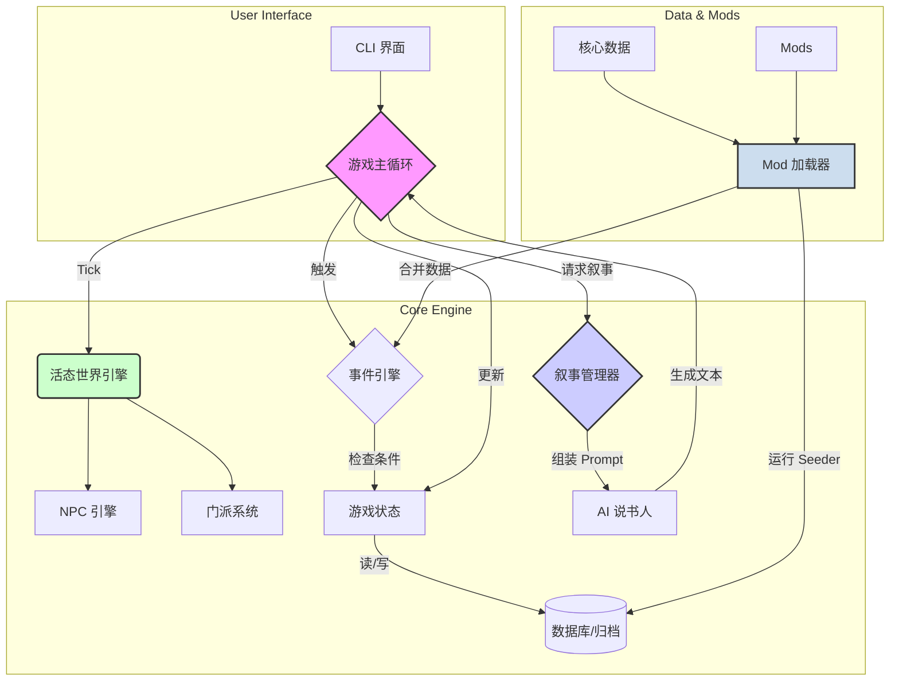

# 《江湖残卷》文档大纲

这是一个为《江湖残卷》项目设计的 `README.md` 和 `USER_GUIDE.md` 的详细大纲。

---

## 第一部分: README.md (面向开发者)

### **1. 项目标题和徽章**

- 标题: `江湖残卷 - AI 驱动的武侠 Roguelike 叙事引擎`
- 徽章:
  - Build Status (构建状态)
  - License (ISC)
  - Prisma
  - TypeScript

### **2. 简介**

- **这是什么?** 一款基于文本的、由大型语言模型 (LLM) 驱动的动态叙事游戏。
- **核心特性**:
  - **AI 说书人**: 每次游戏都是独一无二的故事。
  - **活态世界**: NPC 和宗派会自主发展，世界在后台自行演化。
  - **无限轮回**: 继承前代角色的遗产，开启新的轮回。
  - **高度可扩展**: 强大的 Mod 系统，允许社区创造自己的江湖。

### **3. 项目架构图 (Mermaid)**

- 使用 Mermaid `graph TD` 来展示核心模块及其关系。



### **4. 技术栈**

- **语言**: TypeScript
- **运行环境**: Node.js
- **构建/执行**: `tsx` (开发), `esbuild` (构建)
- **数据库**: `Prisma` + `SQLite`
- **交互**: `inquirer`, `chalk`
- **核心理念**: 数据驱动、模块化、可扩展

### **5. 快速开始 (本地开发)**

1. **环境要求**: Node.js v18+, pnpm
2. **克隆仓库**: `git clone ...`
3. **安装依赖**: `pnpm install`
4. **设置数据库**: `pnpm prisma migrate dev`
5. **运行开发模式**: `pnpm dev`

### **6. 目录结构说明**

- `src/core/`: 核心引擎 (状态、世界、事件、NPC、Mod加载、归档)
- `src/systems/`: 游戏核心机制 (战斗、修炼、宗派、传承)
- `src/narrator/`: AI 说书人模块 (场景管理、Prompt 模板)
- `src/ui/`: 用户界面 (CLI、渲染器)
- `src/data/`: 基础游戏数据 (事件、物品等)
- `prisma/`: 数据库模型和迁移
- `mods/`: 社区 Mod 目录
- `docs/`: 项目文档 (如路线图、设计文档)

### **7. 如何贡献**

- 贡献流程 (Fork -> Branch -> PR)
- 代码风格
- 提交 Issue 的模板
- 欢迎贡献的领域 (例如：新的事件、武学、AI Prompt 优化)

### **8. 路线图**

- 链接到 [`docs/roadmap.md`](docs/roadmap.md)。

---

## 第二部分: USER_GUIDE.md (面向玩家)

### **1. 欢迎来到《江湖残卷》**

- 游戏简介：这是一个没有固定剧本的武侠世界，你的每个选择都将塑造属于你的传奇。

### **2. 如何开始游戏**

1. 下载最新的发行版。
2. 解压文件。
3. 双击运行 `jianghupu.exe` (或 `./jianghupu` for Linux/macOS)。

### **3. 核心概念解释**

- **AI 说书人**: 你的专属故事讲述者，它会根据你的行为和世界的变化来描述你周围发生的一切。你可以通过选择不同的“说书人风格”来改变游戏的氛围。
- **轮回与传承**: 在这个江湖中，死亡不是终点。当你的一生结束后，你可以开启新的轮回，并可能继承前代角色留下的某些“遗产”。
- **活态世界**: 你不是世界的中心。在你探索的同时，NPC 们在修炼，宗派之间在合纵连横。也许你今天路过的小镇，明天就可能被卷入一场正邪大战。

### **4. 基本操作**

- **选择**: 大多数时候，你只需要从 AI 提供的选项中做出选择。
- **指令**: 在提示 `(输入指令)` 时，你可以输入以下命令：
  - `save`: 保存当前进度。
  - `load`: 读取上次的存档。
  - `exit`: 退出游戏。
  - `look`: (待实现) 重新观察当前环境。
  - `status`: (待实现) 查看你的角色状态。

### **5. Mod 系统：打造你的专属江湖**

- **什么是 Mod?** Mod 是社区制作的内容扩展包，可以为游戏增加新的事件、物品、武学、宗派，甚至是全新的玩法。
- **如何安装 Mod?**
  1. 在游戏根目录下找到 `mods` 文件夹。
  2. 将下载的 Mod 文件夹（例如 `a-cool-mod`）解压并放入 `mods` 目录。
  3. 重启游戏，Mod 将被自动加载。
- **哪里可以找到 Mod?** (未来可以链接到社区页面)
- **免责声明**: Mod 是社区内容，请自行承担风险。

### **6. 致谢**

- 感谢所有为这个项目做出贡献的开发者和测试者。

---

## 第三部分: MODDING_GUIDE.md (面向 Mod 作者)

### **1. Mod 系统入门**

- Mod 的能力：你可以添加新的事件、物品、武学、宗派，甚至通过脚本在游戏启动时修改世界。
- 基本原则：Mod 通过添加数据和执行初始化脚本来工作，而不是直接修改核心代码。

### **2. 创建你的第一个 Mod**

1. 在 `mods/` 目录下创建一个新文件夹，例如 `my-first-mod`。
2. 在该文件夹内创建 `manifest.json` 文件。
3. 编写 `manifest.json` 的内容，确保 `id` 是独一无二的。

### **3. `manifest.json` 详解**

- `id`: (必需) 你的 Mod 的唯一标识符。
- `name`: (必需) 显示在日志中的 Mod 名称。
- `author`: (必需) 你的大名。
- `version`: (必需) Mod 版本号 (建议遵循 SemVer)。
- `description`: (可选) Mod 的简要介绍。
- `loadPriority`: (可选) 加载优先级，数字越大越晚加载。默认为 0。

### **4. 数据驱动：添加新内容**

- 在你的 Mod 文件夹中创建 `data/` 目录。
- **示例：添加一个新事件**
  - 创建 `data/events.json` 文件。
  - 添加事件 JSON 对象，解释每个字段：`id`, `type`, `title`, `description`, `trigger`。
  - **重点讲解 `trigger`**:
    - 它是一个 JavaScript 表达式字符串，返回 `true` 或 `false`。
    - 可用变量: `state` (完整的游戏状态), `helpers` (如 `getRandomInt`, `isFactionWarHappening`)。
    - 示例: `"state.player.level > 5 && helpers.getRandomInt(1, 100) <= 10"` (玩家等级大于5时有10%几率触发)。
- **示例：添加新物品/武学**
  - 类似地，创建 `data/items.json` 或 `data/martial_arts.json`。

### **5. 脚本注入：使用 `seed.js`**

- **何时使用?** 当你需要执行数据库操作时，例如创建新宗派、添加初始 NPC 等。
- 在你的 Mod 根目录创建 `seed.js` 文件。
- **示例代码**:

  ```javascript
  // my-first-mod/seed.js
  export async function seed(db) {
    console.log('Seeding data for My First Mod...');
    // db 是一个 Prisma Client 实例，你可以用它来执行任何数据库操作
    await db.faction.upsert({
      where: { name: '神秘组织' },
      update: {},
      create: {
        name: '神秘组织',
        alignment: '中立',
        description: '一个由 Mod 添加的神秘组织。',
      },
    });
    console.log('Finished seeding for My First Mod.');
  }
  ```

- **重要提示**: Seeder 在游戏每次启动时都会运行。请使用 `upsert` 或检查数据是否存在，以避免重复创建。

### **6. 调试你的 Mod**

- 密切关注游戏启动时的控制台日志。
- Mod 加载器会报告 `manifest.json` 错误、数据文件读取失败或 Seeder 执行错误。
