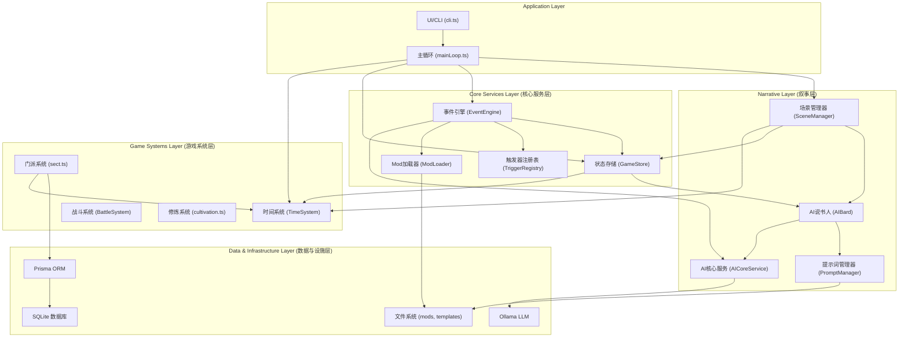
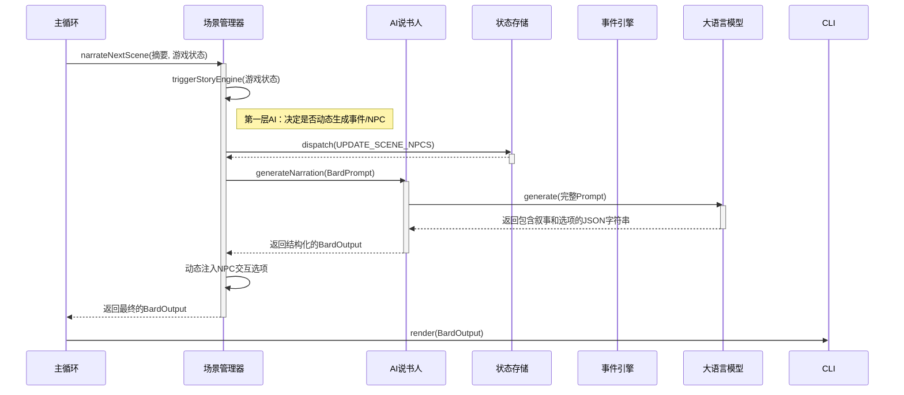

# Wuxia World Simulator - 技术分析报告

## 1. 系统架构图 (System Architecture)

下图展示了项目的主要模块及其依赖关系。箭头表示“依赖于”。

**架构解读:**

*   **分层清晰**: 项目大致分为应用层、叙事层、游戏系统层、核心服务层和数据设施层，职责分明。
*   **依赖倒置**: 上层模块（如 `SceneManager`）依赖于下层模块的抽象（通过 DI 注入），而不是具体实现，符合依赖倒置原则。
*   **核心驱动**: `GameStore` (状态) 和 `EventEngine` (事件) 是整个架构的核心，几乎所有上层模块都直接或间接地与它们交互。
*   **AI 作为服务**: AI 功能被封装在 `AICoreService` 和 `AIBard` 中，作为一种可被调用的服务，而不是散落在各处。

## 2. 核心数据流图 (Core Data Flow) - 叙事场景生成

下图展示了当需要生成一个新叙事场景时，系统内部的数据流转过程。

**数据流解读:**

1.  流程由**主循环**发起，请求**场景管理器**生成新场景。
2.  **场景管理器**首先进行一次“预处理”，通过 `triggerStoryEngine` 询问 AI 是否要即兴发挥，可能会改变当前的游戏状态（如添加 NPC）。
3.  然后，**场景管理器**收集所有上下文信息，请求 **AI说书人** 生成核心叙事。
4.  **AI说书人** 将请求翻译成 LLM 能理解的 Prompt，并从 **LLM** 获取结果。
5.  **场景管理器**在 AI 返回的结果基础上，可能会根据程序逻辑（如场景中有商人）再次加工，添加更多交互选项。
6.  最终结果返回给**主循环**，由 UI 呈现给玩家。

这个流程清晰地展示了程序逻辑与 AI 生成内容是如何协同工作的。