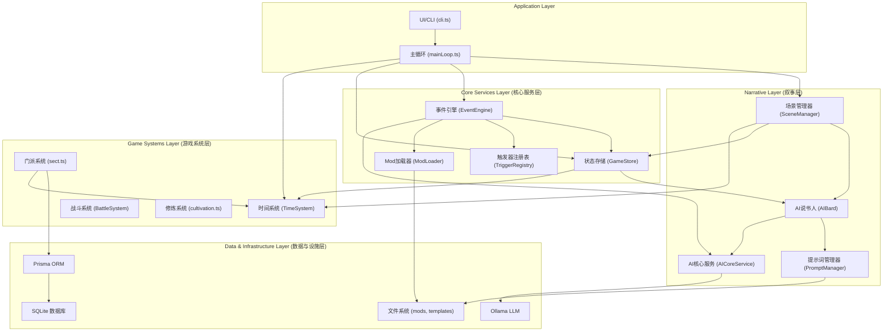
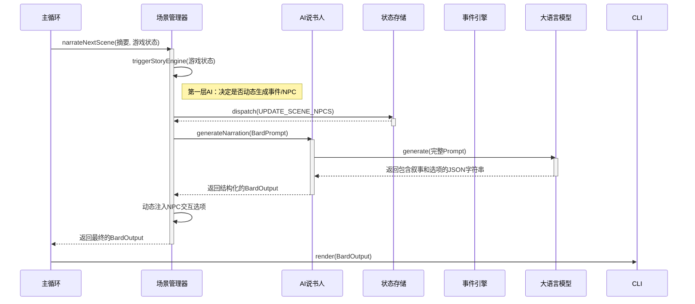

# 《江湖谱》- 详细技术方案文档

**版本: 1.0**
**日期: 2025-11-17**

## 1. 项目概述

《江湖谱》(Wuxia World Simulator) 是一款基于文本的、由 AI 驱动的武侠世界模拟器。项目的核心目标不是创建一个玩家主导的传统 RPG，而是模拟一个动态演化的、充满恩怨情仇的“江湖”。玩家扮演一个身处其中的角色，观察、体验并有限地影响这个世界的变迁。

游戏的核心玩法循环包括：
*   **世界演化**: 游戏世界按照内部时间自动演化，NPC 会成长，门派势力会扩张或衰落，关系会变化，并会爆发战争等重大事件。
*   **AI 叙事**: 玩家的体验主要由一个“AI 说书人”来驱动。它会根据当前的游戏状态，动态生成场景描述、奇遇和玩家选项，创造出独一无二的、非线性的故事线。
*   **事件驱动**: 游戏进程由一系列预设的或由 AI 动态生成的事件来推动。玩家的选择会触发不同的事件结果，从而影响其自身属性和世界的走向。

## 2. 技术栈

| 技术/库 | 用途 | 备注 |
| :--- | :--- | :--- |
| **核心语言与环境** |
| TypeScript | 主要开发语言，提供强类型支持。 | |
| Node.js | 后端运行环境。 | |
| **构建与执行** |
| tsx | 开发环境下的实时 TS 执行器。 | 高性能，无需预编译。 |
| esbuild | 生产环境打包工具。 | 极快的构建速度。 |
| **数据层** |
| Prisma | ORM (对象关系映射)。 | 用于简化数据库操作，提供类型安全。 |
| SQLite | 嵌入式数据库。 | 轻量、便捷，适合单机应用。 |
| **架构与状态管理** |
| tsyringe | 依赖注入 (DI) 容器。 | 实现控制反转 (IoC)，降低模块耦合。 |
| immer | 不可变状态管理。 | 简化 Redux-like 状态更新，保证数据流可预测。 |
| **AI 与叙事** |
| Ollama | 本地大语言模型服务。 | 作为 AI 叙事的核心驱动力。 |
| **用户交互** |
| inquirer | 命令行交互工具。 | 用于创建菜单、提问等。 |
| chalk | 命令行文本样式工具。 | 美化终端输出。 |
| **其他** |
| seedrandom | 确定性随机数生成。 | 用于可复现的游戏模拟或测试。 |

## 3. 架构设计

### 3.1. 总体架构

项目采用了清晰的分层架构，将不同职责的模块有效分离。

### 3.2. 模块职责详解

*   **Application Layer**: 应用的入口和主循环。`mainLoop` 负责协调各大系统，驱动游戏流程；`cli` 负责在终端进行输入输出。
*   **Narrative Layer**: 负责将游戏状态转化为玩家可读的故事。这是项目的灵魂。
    *   `SceneManager`: 叙事流程的“导演”，决定何时、如何生成叙事，并整合 AI 内容和程序逻辑。
    *   `AIBard`: AI 的“客户端”，负责与 LLM 通信，将结构化数据转为 Prompt，并将 LLM 的输出解析为结构化数据。
    *   `PromptManager`: Prompt 工程化的核心，管理和渲染提示词模板。
*   **Game Systems Layer**: 封装了游戏的核心玩法规则。
    *   `TimeSystem`: 游戏世界的“时钟”，提供统一的时间基准。
    *   `FactionSystem`: 驱动门派势力、声望、关系的后台演化。
    *   `BattleSystem`: 处理战斗逻辑，采用接口和适配器模式，设计良好。
*   **Core Services Layer**: 提供被上层模块广泛使用的基础服务。
    *   `GameStore`: 采用 Redux 模式的中央状态管理器，所有游戏状态的唯一真实来源。
    *   `EventEngine`: 负责加载、触发和管理游戏事件，支持数据驱动和 AI 动态生成。
    *   `TriggerRegistry`: 事件触发条件的注册中心，高度可扩展。
    *   `ModLoader`: 负责从外部加载 Mod 数据（如事件、NPC 等），扩展性强。
*   **Data & Infrastructure Layer**: 提供数据持久化、AI 计算和文件访问等底层支持。

## 4. 核心流程分析

### 4.1. 叙事场景生成流程

这是游戏最核心的流程，展示了程序逻辑与 AI 生成的完美结合。

### 4.2. 世界演化流程 (World Update)

这个流程在后台静默发生，通常由时间推进触发。

1.  `mainLoop` 调用 `timeSystem.advanceTime()`。
2.  在每个时间节点（如每月初），`mainLoop` 调用 `gameStore.updateWorld()`。
3.  `updateWorld()` 是一个异步 action，它会调用 `evolveFactions()`。
4.  `evolveFactions()` 从数据库读取所有门派数据，根据内部规则（随机数、阵营等）更新声望和关系强度，并将结果写回数据库。
5.  `evolveFactions()` 检查是否有关系达到临界点（如敌对度 > 100），如果满足条件，则创建一个 `WAR_START` 事件并存入 `EventLog` 表。

## 5. 数据模型 (Prisma Schema)

*   `NPC`: 记录世界中所有人物的核心属性、状态和位置。
*   `EventLog`: 游戏世界的“史书”，记录所有发生的重大事件。
*   `Faction`: 定义了门派/势力的基本信息。
*   `FactionRelationship`: 一张关系表，用于描述任意两个门派之间的关系状态（盟友、敌对、中立）和强度。
*   `MartialArt` & `Item`: 定义了游戏世界中的武学和物品，是可扩展的数据基础。
*   `GameMeta`: 一个灵活的键值存储表，用于记录需要持久化的全局状态，例如已触发的“一次性”事件 ID。

## 6. 现有架构评估

### 6.1. 优点与亮点

1.  **高度模块化与解耦**: 广泛采用依赖注入 (DI) 和事件驱动模式，模块间职责清晰，依赖关系明确，为独立开发和测试提供了便利。
2.  **出色的 AI 整合架构**: 叙事层 (`Narrative Layer`) 的设计非常出色。`PromptManager`、`AIBard`、`SceneManager` 的三层结构将 Prompt 工程、AI 通信和叙事逻辑完美分离。两层 AI 调用（`StoryEngine` + `Narrator`）的设计更是点睛之笔。
3.  **强大的可扩展性**:
    *   **Mod 支持**: `ModLoader` 的存在使得添加新内容（事件、物品、NPC）变得非常容易，只需编写 JSON 文件。
    *   **数据驱动**: 核心玩法（如事件触发）由外部数据 (`events.json`) 驱动，而非硬编码在程序中。
    *   **注册表模式**: `TriggerRegistry` 允许 Mod 或新系统轻松注入自定义的事件触发逻辑。
4.  **现代化的状态管理**: 使用 `GameStore` 作为单一数据源，并结合 `immer` 实现不可变状态更新，确保了数据流的单向、可预测，有效避免了复杂状态下的副作用。
5.  **设计模式运用得当**: 熟练运用了单例、适配器、注册表、观察者等设计模式，代码组织优雅且高效。

### 6.2. 潜在风险与改进点

1.  **入口文件职责过重**: `src/index.ts` 承担了 DI 注册、实例解析、应用启动等多重职责，可以被进一步封装。
2.  **手动依赖解析**: 在 `index.ts` 中需要手动保证 `GameStore` 先于其他服务被解析，这可能隐藏了潜在的循环依赖问题或设计缺陷。
3.  **Reducer 膨胀风险**: `GameStore` 中的 `switch` 语句会随着 Action 增多而变得臃肿，有违“开闭原则”。
4.  **危险的表达式评估**: `TriggerRegistry` 中使用 `new Function()` 来执行表达式，存在安全隐患和调试困难的问题。
5.  **系统设计风格不一**: `TimeSystem` 是类，而 `sect.ts` 是函数集合，架构风格不统一。
6.  **业务逻辑与数据访问耦合**: `sect.ts` 中直接调用 Prisma，将游戏逻辑与数据持久化实现紧密绑定。
7.  **硬编码与魔法数字**: 代码中散落着一些硬编码的逻辑（如 `SceneManager` 中的 NPC 交互判断）和未经定义的常量（如 `hostileThreshold = 100`）。

这些改进点将在下一节的“重构 TODO List”中被详细规划。